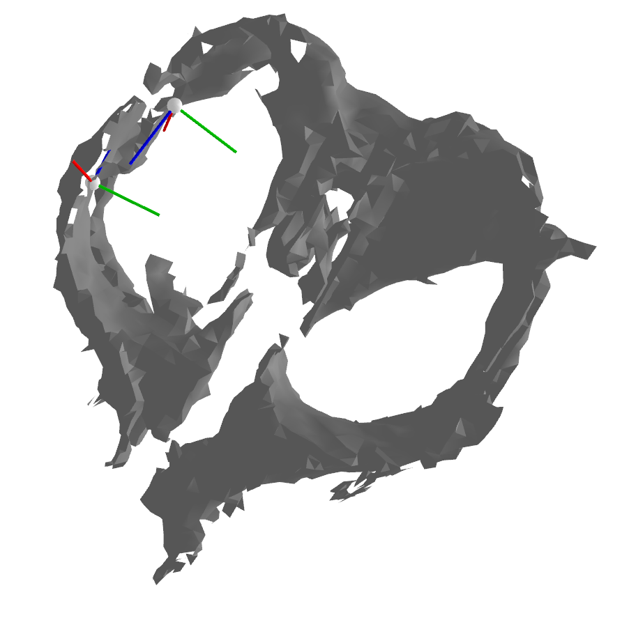

## hanging\_points\_generator

### Setup  
`sudo pip install -e .`  
`pip3 install -r py3_requirement.txt`  
To get voxels contained in voxel grid  
`git clone -b hotfix/voxels https://github.com/kosuke55/Open3D.git`  
and build it with reference to [this page](http://www.open3d.org/docs/release/compilation.html#ubuntu).  

### Mesh Reconstruction demo  
```
python donwload_sample_data.py  
tar -zcvf sample_data.tgz sample_data  
cd examples/  
ipython -i ~.py  
```

### Run  
`roslaunch hanging_points_generator hanging_points_generator.lanuch`  

### create_mesh.py services  
- `/integrate_point_cloud`  : Add rgbd image and camerapose adjusted by icp registration to TSDF volume.  
- `/create_mesh` : Extract mesh.  
- `/meshfix` : Generate the completed mesh(urdf) from the missing mesh(ply).  
- `/generate_hanging_points` : Generate contact points using fixed mesh in pubullet and publish them as PoseArray.
- `/reset_volume` (just util): Reset voulume and integrate count.

### Example
Republish PointCloud and extract it around gripper. ex) [republish_kinectv2_hd_qhdhalf.launch](https://github.com/kosuke55/pr2demo/blob/master/launch/mesh_hooking/republish_kinectv2_hd_qhdhalf.launch), [attention_clipper_gripper.launch](https://github.com/kosuke55/pr2demo/blob/master/launch/mesh_hooking/attention_clipper_giripper.launch)  

In [skrobot_node.py](https://github.com/kosuke55/pr2demo/blob/master/scripts/skrobot_node.py)  
`create_mesh()`  
`generate_hanging_points()`  

And when hooking operation, lauch [mesh_hooking.launch](https://github.com/kosuke55/pr2demo/blob/master/launch/mesh_hooking/mesh_hooking.launch) to detect hook.


### Result
**1.** Collect rgbd images.  
  
**2.** Create mesh using ICP and TSDF, then fix it.  
   
**3.** Find hanging points in pybullet.  
   

### Externals  
[andyzeng/tsdf-fusion-python](https://github.com/andyzeng/tsdf-fusion-python)  
```
@inproceedings{zeng20163dmatch,
    title={3DMatch: Learning Local Geometric Descriptors from RGB-D Reconstructions},
    author={Zeng, Andy and Song, Shuran and Nie{\ss}ner, Matthias and Fisher, Matthew and Xiao, Jianxiong and Funkhouser, Thomas},
    booktitle={CVPR},
    year={2017}
}
```
