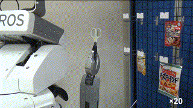
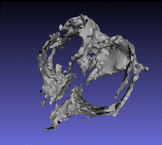
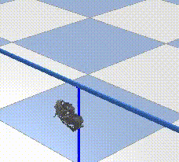

## hanging\_points\_generator

### Setup  
`sudo pip install -e .`
`pip3 install -r py3_requirement.txt`

### Run  
`roslaunch hanging_points_generator hanging_points_generator.lanuch`  

### create_mesh.py services  
- `/integrate_point_cloud`  : Add rgbd image and camerapose adjusted by icp registration to TSDF volume.  
- `/create_mesh` : Extract mesh.  
- `/meshfix` : Generate the completed mesh(urdf) from the missing mesh(ply).  
- `/generate_hanging_points` : Generate contact points using fixed mesh in pubullet and publish them as PoseArray.
- `/reset_volume` (just util): Reset voulume and integrate count.

### Example
Republish PointCloud and extract it around gripper. [republish_kinectv2_hd_desktop.launch](https://github.com/kosuke55/pr2demo/blob/master/launch/republish_kinectv2_hd_desktop.launch), [attention_clipper_gripper.launch](https://github.com/kosuke55/pr2demo/blob/master/launch/attention_clipper_giripper.launch)  

In [skrobot_node.py](https://github.com/kosuke55/pr2demo/blob/master/scripts/skrobot_node.py)  
`create_mesh()`  
`generate_hanging_points()`  

### Result
1. Collect rgbd images.   

1.  Create mesh using ICP and TSDF, then fix it.  
   
1.  Find hanging points in pybullet.  

  
